<div align="center">


<br/>

<!-- CORE TECH BADGES -->
[](https://mongodb.com)
[](https://expressjs.com)
[](https://reactjs.org)
[](https://nodejs.org)
[](https://ibm.com/watson)
[](https://docker.com)
[](https://flask.palletsprojects.com)
[](https://razorpay.com)
[](https://twilio.com)

<br/>

[](https://github.com)
[](https://github.com)
[](LICENSE)
[](CONTRIBUTING.md)
[]()

<br/>

> ### 🚀 *"Redefining the online shopping experience through the transformative power of AI, machine learning, and modern full-stack engineering."*

<br/>

**A production-grade, AI-powered MERN e-commerce platform for BREW-N-FILL® — featuring IBM Watson Assistant chatbot, WhatsApp order integration, Docker containerization, real-time sentiment analysis, and Razorpay payment processing.**

<br/>

[🎯 Overview](#-project-overview) • [🏗 Architecture](#️-system-architecture) • [✨ Features](#-feature-highlights) • [🤖 AI Engine](#-ai--ml-engine) • [📦 Setup](#-installation--setup) • [🐳 Docker](#-docker-deployment) • [📊 Outputs](#-output-screens)

</div>

## Screenshots
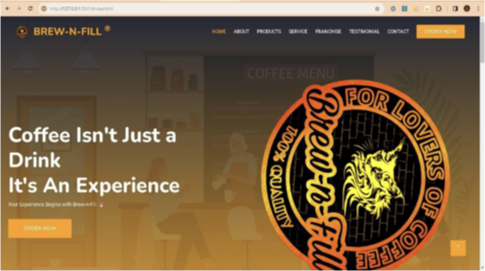
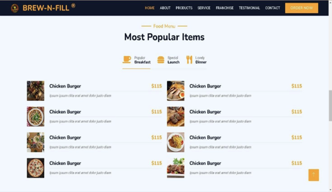
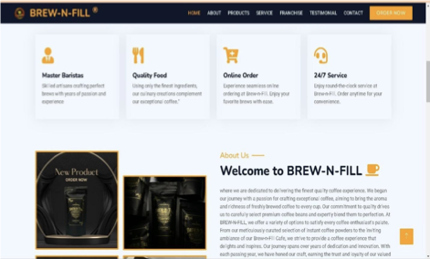
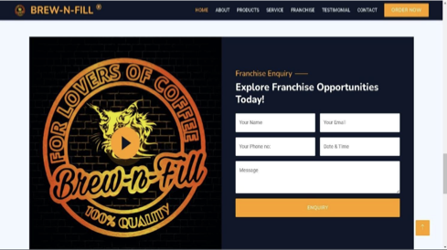

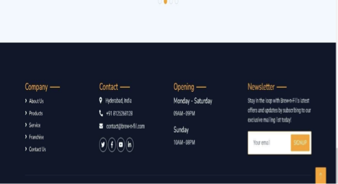
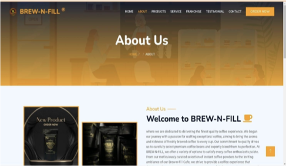
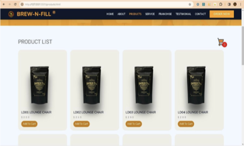
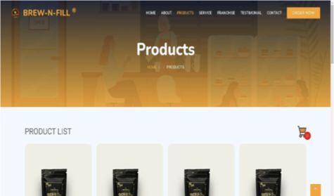

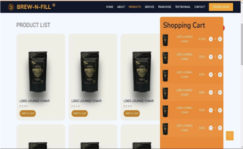

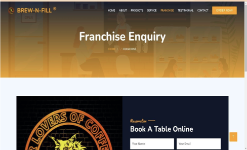

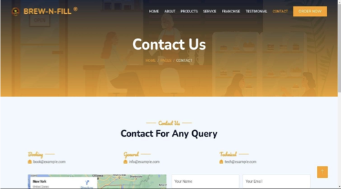
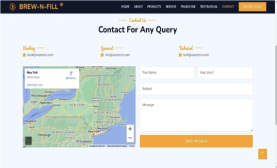


## 📌 Table of Contents

- [🎯 Project Overview](#-project-overview)
- [💡 Motivation & Problem Statement](#-motivation--problem-statement)
- [🏗️ System Architecture](#️-system-architecture)
- [✨ Feature Highlights](#-feature-highlights)
- [🤖 AI & ML Engine](#-ai--ml-engine)
- [🛠️ Tech Stack — Full Breakdown](#️-tech-stack--full-breakdown)
- [⚙️ Software Specifications](#️-software-specifications)
- [🖥️ Hardware Specifications](#️-hardware-specifications)
- [🗂️ Project Structure](#️-project-structure)
- [🔄 Workflow & Methodology](#-workflow--methodology)
- [📦 Installation & Setup](#-installation--setup)
- [🐳 Docker Deployment](#-docker-deployment)
- [🛒 E-Commerce Engine](#-e-commerce-engine)
- [💬 Watson Chatbot Integration](#-watson-chatbot-integration)
- [📩 WhatsApp Order System](#-whatsapp-order-system)
- [🎫 Customer Service Ticketing](#-customer-service-ticketing)
- [📊 Output Screens](#-output-screens)
- [🧪 Testing](#-testing)
- [🗺️ Roadmap](#️-roadmap)
- [📄 License](#-license)

---

## 🎯 Project Overview

**Full-Stack-E-Commerce-Platform-MERN** is an enterprise-grade smart shopping platform built for **BREW-N-FILL®** — Hyderabad's premium coffee brand. It represents a fusion of modern full-stack development and cutting-edge artificial intelligence to deliver an end-to-end, delightful digital shopping experience.

```
┌──────────────────────────────────────────────────────────┐
│              WHAT MAKES THIS DIFFERENT                   │
│                                                          │
│  🧠 IBM Watson AI  →  Conversational intelligence        │
│  🐳 Docker         →  Containerized, cloud-ready         │
│  📱 WhatsApp Bot   →  Orders via messaging               │
│  💬 Sentiment AI   →  Real-time customer mood detection  │
│  🎫 Ticketing      →  Structured support management      │
│  🍃 MERN Stack     →  Scalable, modern architecture      │
│  🐍 Flask          →  Python ML microservice bridge      │
│  💳 Razorpay       →  Seamless Indian payment gateway    │
└──────────────────────────────────────────────────────────┘
```

### 🏆 Project Identity

| Attribute | Detail |
|-----------|--------|
| 📛 Project Name | Smart E-Commerce: Streamlined Online Shopping with AI |
| 🏷️ Brand | BREW-N-FILL® Coffee |
| 🏫 Department | Electronics & Computer Science (ECS) |
| 🔖 Version | 1.0.0 |
| 📍 Location | Hyderabad, India |
| ⚙️ Architecture | MERN + Flask Microservice + IBM Cloud |
| 🐳 Containerization | Docker |
| 💳 Payments | Razorpay (INR) |
| 📡 Messaging | Twilio (SMS + WhatsApp) |

---

## 💡 Motivation & Problem Statement

### 🔥 Motivation

The digital coffee market is growing at an unprecedented rate, yet most e-commerce platforms offer a **one-dimensional shopping experience** — a catalogue with a payment gateway. BREW-N-FILL envisioned something far more ambitious:

> *"What if a customer could browse, ask questions, get personalized recommendations, place orders via WhatsApp, and receive real-time support — all within a single, intelligent platform?"*

This project was born to answer that question.

### ❌ Problems with Existing Systems

| Existing System Limitation | Our Solution |
|---------------------------|-------------|
| Static product catalogs, no personalization | AI-driven product discovery with Watson |
| No intelligent customer support | 24/7 IBM Watson chatbot with NLU |
| Fragmented ordering channels | Unified web + WhatsApp order system |
| Manual customer query handling | Automated ticketing & routing system |
| Monolithic, hard-to-scale architecture | Docker-containerized microservices |
| No mood/sentiment understanding | Real-time sentiment analysis on chat |
| Python ML tools incompatible with Node.js | Flask microservice bridge |

### ✅ Objectives

1. Build a **feature-rich MERN e-commerce platform** for coffee products
2. Integrate **IBM Watson Assistant** for AI-powered, natural language customer support
3. Enable **WhatsApp-based ordering** via Twilio integration
4. Implement **real-time sentiment analysis** on customer interactions
5. Containerize the entire platform using **Docker** for deployment flexibility
6. Build a **customer service ticketing system** for structured query management
7. Integrate **Razorpay** for seamless Indian payment processing
8. Bridge Python ML capabilities via a **Flask microservice**

---

## 🏗️ System Architecture

```
╔═════════════════════════════════════════════════════════════════════════╗
║                     CLIENT LAYER (React.js)                             ║
║  ┌──────────┐  ┌──────────┐  ┌──────────┐  ┌──────────┐  ┌──────────┐   ║
║  │  Product │  │   Cart   │  │ Checkout │  │ Chatbot  │  │  Ticket  │   ║
║  │  Catalog │  │ & Orders │  │ Razorpay │  │   UI     │  │  Portal  │   ║
║  └──────────┘  └──────────┘  └──────────┘  └──────────┘  └──────────┘   ║
╠═════════════════════════════════════════════════════════════════════════╣
║                   API GATEWAY (Express.js / Node.js)                    ║
║   REST APIs  │  Auth Middleware  │  Rate Limiting  │  Session Mgmt      ║
╠══════════════════════╦═══════════════════════╦══════════════════════════╣
║  CORE SERVICES       ║  AI/ML MICROSERVICE   ║  MESSAGING SERVICES      ║
║  ┌────────────────┐  ║  ┌─────────────────┐  ║  ┌────────────────────┐  ║
║  │ Product Svc    │  ║  │ Flask + Python  │  ║  │ Twilio SMS/WA      │  ║
║  │ Order Svc      │  ║  │ Sentiment Model │  ║  │ WhatsApp Orders    │  ║
║  │ Payment Svc    │  ║  │ Recommendation  │  ║  │ OTP Verification   │  ║
║  │ Ticket Svc     │  ║  │ Engine          │  ║  └────────────────────┘  ║
║  └────────────────┘  ║  └─────────────────┘  ║                          ║
╠══════════════════════╩═══════════════════════╩══════════════════════════╣
║                    IBM CLOUD INTEGRATION LAYER                          ║
║         IBM Watson Assistant (NLU + Dialog + Intent Recognition)        ║
╠═════════════════════════════════════════════════════════════════════════╣
║                       DATA LAYER (MongoDB)                              ║
║   Users │ Products │ Orders │ Cart │ Tickets │ Chat Logs │ Sentiments   ║
╠═════════════════════════════════════════════════════════════════════════╣
║                    INFRASTRUCTURE LAYER (Docker)                        ║
║   Web Container │ API Container │ Flask Container │ MongoDB Container   ║
╚═════════════════════════════════════════════════════════════════════════╝
```

### 🤖 Chatbot Architecture (IBM Watson)

```
User Message (Text/Voice)
        │
        ▼
┌───────────────────────┐
│  IBM Watson Assistant │
│  ├─ NLU Processing    │  ← Natural Language Understanding
│  ├─ Intent Detection  │  ← "order coffee" / "track order" / "support"
│  ├─ Entity Extraction │  ← Product name, quantity, date
│  └─ Dialog Manager    │  ← Conversation flow control
└──────────┬────────────┘
           │
     ┌─────┴──────┐
     ▼            ▼
  API Call    Direct Reply
  to Backend  to User
     │
     ▼
  Order / Info / Ticket Created
```

---

## ✨ Feature Highlights

### 🛒 E-Commerce Core
| Feature | Description |
|---------|-------------|
| 🛍️ Product Catalog | Dynamic, JSON-driven product grid (4→3→2 col responsive) |
| 🛒 Smart Cart | Real-time cart with localStorage persistence, quantity controls |
| 💳 Razorpay Checkout | Native INR payment gateway, full order lifecycle |
| 🔍 Product Search | Real-time search and filter capabilities |
| 📦 Order Tracking | Order status updates with notification support |

### 🤖 AI & Intelligence
| Feature | Description |
|---------|-------------|
| 🧠 IBM Watson Chatbot | NLU-powered 24/7 assistant for product queries & support |
| 📊 Sentiment Analysis | Real-time detection of customer mood (positive/negative/neutral) |
| 🎯 Smart Recommendations | ML-powered product suggestions based on behavior |
| 📱 WhatsApp Bot | Place and track orders directly from WhatsApp |

### 🏪 Business Operations
| Feature | Description |
|---------|-------------|
| 🎫 Ticketing System | Structured customer query management & routing |
| 📩 SMS Notifications | Twilio-powered order confirmations & alerts |
| 🏪 Franchise Portal | Enquiry form with instant SMS to business owner |
| 📧 Newsletter | Subscriber management for promotions |

### ⚡ Technical Excellence
| Feature | Description |
|---------|-------------|
| 🐳 Docker | Full containerization of all services |
| 🍃 MongoDB | Flexible NoSQL schema for products, users, orders |
| 🐍 Flask Bridge | Python ML models accessible via REST from Node.js |
| 🔄 Agile Dev | Iterative delivery with sprint-based development |

---

## 🤖 AI & ML Engine

### IBM Watson Assistant Integration

The platform's crown jewel — **IBM Watson Assistant** — powers a contextually aware, multi-turn conversational AI interface that understands customer intent with remarkable accuracy.

```javascript
// Watson Assistant API Integration
const AssistantV2 = require('ibm-watson/assistant/v2');
const { IamAuthenticator } = require('ibm-watson/auth');

const assistant = new AssistantV2({
    version: '2023-06-15',
    authenticator: new IamAuthenticator({ apikey: process.env.WATSON_API_KEY }),
    serviceUrl: process.env.WATSON_SERVICE_URL,
});

// Process user message through Watson NLU pipeline
const watsonResponse = await assistant.message({
    assistantId: process.env.WATSON_ASSISTANT_ID,
    sessionId: sessionId,
    input: {
        'message_type': 'text',
        'text': userMessage,
    },
});
```

### Watson Capabilities Deployed

| Intent | Watson Handles |
|--------|---------------|
| `#order_coffee` | Captures product, quantity, delivery details |
| `#track_order` | Queries MongoDB for real-time status |
| `#product_info` | Returns catalog data with pricing |
| `#franchise_enquiry` | Routes to SMS notification pipeline |
| `#raise_ticket` | Creates structured support ticket |
| `#opening_hours` | Returns schedule from config |
| `#general_greetings` | Warm, brand-aligned responses |

### 🐍 Flask ML Microservice

Python's rich ML ecosystem is made available to the Node.js backend via a **Flask REST microservice**:

```python
# flask_service/app.py

from flask import Flask, request, jsonify
from sentiment_model import analyze_sentiment
from recommendation_engine import get_recommendations

app = Flask(__name__)

@app.route('/analyze-sentiment', methods=['POST'])
def sentiment():
    data = request.get_json()
    result = analyze_sentiment(data['message'])
    return jsonify({
        'sentiment': result['label'],       # POSITIVE / NEGATIVE / NEUTRAL
        'confidence': result['score'],       # 0.0 – 1.0
        'emotion': result.get('emotion')     # joy / anger / sadness / etc.
    })

@app.route('/recommendations', methods=['POST'])
def recommendations():
    user_history = request.get_json()['history']
    products = get_recommendations(user_history)
    return jsonify({'recommended': products})

if __name__ == '__main__':
    app.run(host='0.0.0.0', port=5000)
```

### Real-Time Sentiment Analysis UI

```
┌─────────────────────────────────────────────┐
│  😊 SENTIMENT: POSITIVE  [Confidence: 94%]  │  ← Live badge
├─────────────────────────────────────────────┤
│  User: "I absolutely love your espresso!"   │
│  Bot:  "Thank you! Would you like to order? │
│         Our Arabica blend is on sale today."│
│  User: "What's the delivery time?"          │
│  Bot:  "We deliver within 2-3 business days"│
└─────────────────────────────────────────────┘
```

---

## 🛠️ Tech Stack — Full Breakdown

### MERN Stack

```
M — MongoDB        │ NoSQL database: products, users, orders, tickets, sessions
E — Express.js     │ RESTful API framework, middleware pipeline, routing
R — React.js       │ Component-based UI, hooks, context API, state management  
N — Node.js        │ Server runtime, async I/O, package ecosystem
```

### Extended Stack

| Layer | Technology | Purpose |
|-------|-----------|---------|
| AI/NLU | IBM Watson Assistant (Cloud) | Natural language understanding, dialog management |
| ML Service | Flask (Python) | Sentiment analysis, recommendation engine |
| Containers | Docker + Docker Compose | Service isolation, deployment portability |
| Payments | Razorpay | INR payment gateway, order creation |
| Messaging | Twilio | SMS alerts, WhatsApp bot, OTP |
| IDE | Visual Studio Code | Development environment |
| DB | MongoDB + Mongoose | Data persistence, schema validation |
| Styling | Bootstrap 5 + Custom CSS | Responsive UI framework |
| Animations | WOW.js + Animate.css | Scroll-triggered UI effects |
| Carousel | Owl Carousel | Testimonials, product sliders |
| Date/Time | Tempus Dominus | Franchise scheduling picker |

---

## ⚙️ Software Specifications

### Application Programming Interfaces

| API | Provider | Usage |
|-----|----------|-------|
| Watson Assistant API v2 | IBM Cloud | Chatbot NLU + dialog |
| Razorpay Orders API | Razorpay | Payment order creation |
| Twilio Messages API | Twilio | SMS + WhatsApp notifications |
| Flask REST API | Internal | Python ML service bridge |

### IBM Cloud Configuration

```yaml
# ibm-watson-config.yml
watson_assistant:
  version: "2023-06-15"
  region: "us-south"
  plan: "Plus"
  features:
    - Natural Language Understanding (NLU)
    - Dialog Flow Management
    - Intent & Entity Recognition
    - Multi-turn Conversation
    - Webhook Integration
    - Sentiment Analysis
```

### Package Dependencies

#### MERN Stack Packages
```json
{
  "dependencies": {
    "express":          "^4.19.2",
    "mongoose":         "^6.1.8",
    "body-parser":      "^1.20.2",
    "twilio":           "^5.0.3",
    "ibm-watson":       "^8.0.0",
    "razorpay":         "^2.9.2",
    "dotenv":           "^16.0.0",
    "cors":             "^2.8.5",
    "jsonwebtoken":     "^9.0.0",
    "bcryptjs":         "^2.4.3",
    "socket.io":        "^4.7.0"
  },
  "devDependencies": {
    "nodemon":    "^3.0.0",
    "jest":       "^29.0.0",
    "supertest":  "^6.3.0"
  }
}
```

#### Flask / Python Packages
```txt
flask==3.0.0
flask-cors==4.0.0
transformers==4.35.0
torch==2.1.0
pandas==2.1.0
scikit-learn==1.3.0
ibm-watson==8.0.0
requests==2.31.0
gunicorn==21.2.0
```

#### Docker Services
```yaml
# docker-compose.yml (preview)
services:
  web:      # React frontend
  api:      # Node.js / Express backend
  flask:    # Python ML microservice
  mongodb:  # MongoDB database
  nginx:    # Reverse proxy
```

---

## 🖥️ Hardware Specifications

| Component | Specification |
|-----------|--------------|
| **Server Type** | Cloud-based VPS or Dedicated Server |
| **Processor** | Dual-core or Quad-core, ≥ 2.5 GHz |
| **RAM** | Minimum 8 GB (handles MERN + Flask + Watson concurrent load) |
| **Storage** | SSD, minimum 100 GB (fast I/O for MongoDB operations) |
| **Network** | Gigabit Ethernet — handles traffic spikes during promotions |
| **OS** | Ubuntu Server (Linux) — Node.js + Docker compatible |
| **Web Server** | Nginx (reverse proxy + static file serving) |
| **Database** | MongoDB with SSD-backed storage |
| **Bandwidth** | Scalable allocation for peak shopping events |

---

## 🗂️ Project Structure

```
Full-Stack-E-Commerce-Platform-MERN/
│
├── 📁 client/                          # React.js Frontend
│   ├── public/
│   │   ├── index.html
│   │   └── favicon.ico
│   └── src/
│       ├── components/
│       │   ├── Navbar/
│       │   ├── ProductCard/
│       │   ├── Cart/
│       │   ├── Chatbot/               # Watson chat widget
│       │   ├── SentimentBadge/        # Live sentiment display
│       │   └── TicketForm/
│       ├── pages/
│       │   ├── Home.jsx
│       │   ├── Products.jsx
│       │   ├── About.jsx
│       │   ├── Service.jsx
│       │   ├── Franchise.jsx
│       │   ├── Testimonials.jsx
│       │   └── Contact.jsx
│       ├── context/
│       │   ├── CartContext.js
│       │   └── AuthContext.js
│       └── App.jsx
│
├── 📁 server/                          # Node.js + Express Backend
│   ├── routes/
│   │   ├── products.js
│   │   ├── orders.js
│   │   ├── auth.js
│   │   ├── franchise.js               # Twilio SMS handler
│   │   ├── watson.js                  # IBM Watson proxy
│   │   ├── payment.js                 # Razorpay integration
│   │   └── tickets.js                 # Support ticketing
│   ├── models/
│   │   ├── Product.js
│   │   ├── User.js
│   │   ├── Order.js
│   │   └── Ticket.js
│   ├── middleware/
│   │   ├── auth.js
│   │   └── rateLimiter.js
│   └── server.js                      # Express entry point
│
├── 📁 flask_service/                   # Python ML Microservice
│   ├── app.py                         # Flask REST API
│   ├── sentiment_model.py             # Sentiment analysis engine
│   ├── recommendation_engine.py       # Product recommendations
│   ├── requirements.txt
│   └── Dockerfile
│
├── 📁 static/                          # Legacy HTML Static Site
│   ├── index.html
│   ├── about.html
│   ├── products.html
│   ├── service.html
│   ├── franchise.html
│   ├── testimonial.html
│   ├── contact.html
│   ├── privacy.html
│   ├── css/
│   │   ├── style.css
│   │   └── bootstrap.min.css
│   ├── js/
│   │   └── main.js
│   ├── img/
│   │   ├── hero.png
│   │   ├── bg-hero.jpg
│   │   ├── about1-4.jpg
│   │   ├── menu-1 to 8.jpg
│   │   └── testimonial-1-4.jpg
│   └── lib/
│       ├── animate/
│       ├── owlcarousel/
│       ├── tempusdominus/
│       ├── wow/
│       ├── easing/
│       ├── waypoints/
│       └── counterup/
│
├── 📄 docker-compose.yml               # Full stack orchestration
├── 📄 Dockerfile                       # Root container config
├── 📄 .env.example                     # Environment variables template
├── 📄 package.json                     # Node.js root dependencies
├── 📄 product.json                     # Product catalog seed data
└── 📄 README.md
```

---

## 🔄 Workflow & Methodology

### Agile Development Methodology

This project followed **Agile Scrum** with iterative sprints:

```
Sprint 1  │ Static site + Bootstrap UI + Product catalog
Sprint 2  │ Node.js + Express API + MongoDB integration
Sprint 3  │ Cart, localStorage, Razorpay payment gateway
Sprint 4  │ IBM Watson integration + chatbot dialog flows
Sprint 5  │ Flask microservice + sentiment analysis
Sprint 6  │ Twilio SMS + WhatsApp order bot
Sprint 7  │ Customer ticketing system
Sprint 8  │ Docker containerization + deployment
Sprint 9  │ Testing, QA, performance optimization
Sprint 10 │ Documentation + final review
```

### Application Workflow

```
User Visits Site
       │
       ├──▶ Browse Products ──▶ Add to Cart ──▶ Checkout ──▶ Razorpay ──▶ ✅ Order Confirmed
       │                                                                      │
       │                                                                      └──▶ Twilio SMS
       │
       ├──▶ Chat with Watson ──▶ NLU Processing ──▶ Intent Matched
       │         │                                        │
       │         │                               ┌────────┴────────┐
       │         └──▶ Sentiment Logged            ▼                ▼
       │                                    API Response     Ticket Created
       │
       ├──▶ WhatsApp Message ──▶ Twilio Webhook ──▶ Watson NLU ──▶ Order via WA
       │
       └──▶ Franchise Enquiry ──▶ POST /franchise-enquiry ──▶ Twilio SMS to Owner
```

---

## 📦 Installation & Setup

### Prerequisites

```bash
Node.js     >= 16.x
npm         >= 8.x
Python      >= 3.10
pip         >= 22.x
MongoDB     >= 6.0  (or MongoDB Atlas URI)
Docker      >= 24.0  (for containerized setup)
Git
```

### 🔧 Method 1: Local Development Setup

#### Step 1 — Clone the Repository
```bash
git clone https://github.com/yourusername/Full-Stack-E-Commerce-Platform-MERN.git
cd Full-Stack-E-Commerce-Platform-MERN
```

#### Step 2 — Environment Configuration
```bash
cp .env.example .env
```

Edit `.env` with your credentials:
```env
# Server
PORT=3000
NODE_ENV=development

# MongoDB
MONGODB_URI=mongodb://localhost:27017/brew-n-fill
# or MongoDB Atlas:
# MONGODB_URI=mongodb+srv://<user>:<pass>@cluster.mongodb.net/brew-n-fill

# JWT
JWT_SECRET=your_super_secret_jwt_key_here

# IBM Watson Assistant
WATSON_API_KEY=your_watson_api_key
WATSON_SERVICE_URL=https://api.us-south.assistant.watson.cloud.ibm.com
WATSON_ASSISTANT_ID=your_watson_assistant_id

# Twilio (SMS + WhatsApp)
TWILIO_ACCOUNT_SID=ACxxxxxxxxxxxxxxxxxxxxxxxxxxxxxxxx
TWILIO_AUTH_TOKEN=your_twilio_auth_token
TWILIO_PHONE_NUMBER=+12514188416
BUSINESS_PHONE_NUMBER=+918125268128

# Razorpay
RAZORPAY_KEY_ID=your_razorpay_key_id
RAZORPAY_KEY_SECRET=your_razorpay_key_secret

# Flask ML Service
FLASK_SERVICE_URL=http://localhost:5000
```

#### Step 3 — Install Node.js Dependencies
```bash
npm install
```

#### Step 4 — Install & Run Flask Service
```bash
cd flask_service
pip install -r requirements.txt
python app.py
# Flask runs on http://localhost:5000
```

#### Step 5 — Seed Product Database
```bash
npm run seed
# Loads product.json into MongoDB
```

#### Step 6 — Start the Application
```bash
# Development (with hot reload)
npm run dev

# Production
npm start
```

> 🌐 App: **http://localhost:3000**
> 🐍 Flask API: **http://localhost:5000**
> 🔧 Admin: **http://localhost:3000/admin**

---

## 🐳 Docker Deployment

The entire platform — Node.js, Flask, MongoDB, Nginx — runs in isolated Docker containers orchestrated via Docker Compose.

### Docker Architecture

```
┌─────────────────────────────────────────────┐
│              Docker Host Machine            │
│                                             │
│  ┌──────────┐  ┌──────────┐  ┌──────────┐   │
│  │  nginx   │  │  web     │  │  api     │   │
│  │  :80/443 │  │  React   │  │  Node.js │   │
│  │  (proxy) │  │  :3000   │  │  :3001   │   │
│  └────┬─────┘  └──────────┘  └────┬─────┘   │
│       │                           │         │
│  ┌────▼──────────────────────┐    │         │
│  │        Internal Network   │◄───┘         │
│  └────┬─────────────┬────────┘              │
│       │             │                       │
│  ┌────▼─────┐  ┌────▼──────┐                │
│  │  flask   │  │  mongodb  │                │
│  │  Python  │  │  :27017   │                │
│  │  :5000   │  │           │                │
│  └──────────┘  └───────────┘                │
└─────────────────────────────────────────────┘
```

### docker-compose.yml

```yaml
version: '3.9'

services:
  nginx:
    image: nginx:alpine
    ports:
      - "80:80"
      - "443:443"
    depends_on:
      - web
      - api
    volumes:
      - ./nginx.conf:/etc/nginx/nginx.conf

  web:
    build: ./client
    environment:
      - REACT_APP_API_URL=http://api:3001
      - REACT_APP_WATSON_URL=${WATSON_SERVICE_URL}

  api:
    build: ./server
    environment:
      - MONGODB_URI=mongodb://mongodb:27017/brew-n-fill
      - FLASK_SERVICE_URL=http://flask:5000
      - WATSON_API_KEY=${WATSON_API_KEY}
      - TWILIO_ACCOUNT_SID=${TWILIO_ACCOUNT_SID}
      - RAZORPAY_KEY_ID=${RAZORPAY_KEY_ID}
    depends_on:
      - mongodb
      - flask

  flask:
    build: ./flask_service
    environment:
      - FLASK_ENV=production

  mongodb:
    image: mongo:6.0
    volumes:
      - mongo_data:/data/db

volumes:
  mongo_data:
```

### One-Command Deployment

```bash
# Build and start all containers
docker-compose up --build -d

# View running containers
docker-compose ps

# View logs
docker-compose logs -f api

# Stop all services
docker-compose down
```

---

## 🛒 E-Commerce Engine

### Cart State Management

```javascript
// Real-time cart — persisted in localStorage, synced with MongoDB on checkout
const addToCart = (product_id) => {
    let idx = cart.findIndex(v => v.product_id == product_id);
    if (cart.length <= 0)        cart = [{ product_id, quantity: 1 }];
    else if (idx < 0)            cart.push({ product_id, quantity: 1 });
    else                         cart[idx].quantity += 1;

    addCartToHTML();
    localStorage.setItem('cart', JSON.stringify(cart));  // Persistence
};
```

### Razorpay Payment Flow

```
Customer Clicks "Checkout"
          │
          ▼
calculateTotalAmount()   ← Sums price × quantity for all cart items
          │
          ▼
POST /create-order       ← Express creates Razorpay order (amount in paise)
          │
          ▼
razorpay.open({...})     ← Native Razorpay checkout modal opens
          │
     ┌────┴────┐
     ▼         ▼
  Success    Failure
     │
     ▼
Order saved to MongoDB
Twilio SMS confirmation sent
Cart cleared
```

---

## 💬 Watson Chatbot Integration

### Setting Up Watson Assistant

1. Create an **IBM Cloud account** at [cloud.ibm.com](https://cloud.ibm.com)
2. Provision a **Watson Assistant** service instance
3. Create a new **Assistant** and configure:
   - Add intents (e.g., `#order_coffee`, `#track_order`, `#raise_ticket`)
   - Define entities (e.g., `@product_name`, `@quantity`, `@location`)
   - Design dialog flows with conditional responses
4. Copy your **API Key**, **Service URL**, and **Assistant ID** to `.env`

### Key Dialog Intents

```yaml
intents:
  - intent: order_coffee
    examples:
      - "I want to order coffee"
      - "Can I buy the Arabica blend?"
      - "Place an order for cold brew"

  - intent: track_order
    examples:
      - "Where is my order?"
      - "Track my delivery"
      - "What's my order status?"

  - intent: raise_ticket
    examples:
      - "I have a complaint"
      - "Something went wrong with my order"
      - "I need help with my purchase"
```

---

## 📩 WhatsApp Order System

Customers can place coffee orders **directly via WhatsApp** — no app download required.

```
Customer sends WhatsApp message to BREW-N-FILL number
                    │
                    ▼
         Twilio Webhook receives message
                    │
                    ▼
         Watson NLU processes intent
                    │
              ┌─────┴──────┐
              ▼            ▼
         Order Intent   Other Intent
              │            │
              ▼            ▼
      Capture product   Watson dialog
      & qty via dialog  responds directly
              │
              ▼
      POST /orders → MongoDB
              │
              ▼
      WhatsApp reply: "Your order for 2× Arabica Blend 
      has been placed! Order ID: #BNF2024001"
```

---

## 🎫 Customer Service Ticketing

A dedicated ticketing module ensures **no customer query is left unresolved**.

```
Ticket Lifecycle:
OPEN → ASSIGNED → IN_PROGRESS → RESOLVED → CLOSED

Ticket Schema (MongoDB):
{
  ticketId:    "TKT-2024-001",
  customer:    { name, email, phone },
  category:    "order_issue" | "product_query" | "franchise" | "general",
  priority:    "low" | "medium" | "high" | "urgent",
  status:      "open" | "assigned" | "in_progress" | "resolved",
  description: "...",
  chatLog:     [...Watson conversation history],
  sentiment:   "negative",              // Auto-tagged from sentiment model
  assignedTo:  "support_agent_id",
  createdAt:   ISODate,
  resolvedAt:  ISODate
}
```

---

## 📊 Output Screens

> 📸 *Screenshot placeholders — replace with actual captures from your running application.*

| Screen | Description |
|--------|-------------|
| 🏠 **Home Page** | Hero banner with rotating coffee animation, service highlights, food menu, franchise CTA |
| 🛍️ **Products Page** | 4-column product grid with add-to-cart, dynamic from MongoDB |
| 🛒 **Cart Sidebar** | Slide-in cart panel with quantity controls and Razorpay checkout |
| 💬 **Watson Chat** | Full-screen AI chat with sentiment badge, gradient bubbles |
| 🎫 **Ticket Portal** | Support form with category, priority, and status tracking |
| 📊 **Admin Panel** | Order management, ticket queue, analytics overview |
| 📱 **WhatsApp Order** | Conversation flow showing product selection and confirmation |
| 🐳 **Docker Dashboard** | Container health and logs via Docker Compose |

---

## 🧪 Testing

### Running the Test Suite

```bash
# Unit + Integration Tests (Jest + Supertest)
npm test

# Specific test modules
npm test -- --testPathPattern=routes/products
npm test -- --testPathPattern=watson
npm test -- --testPathPattern=payment

# Flask service tests
cd flask_service && python -m pytest tests/
```

### Test Coverage Areas

| Module | Tests |
|--------|-------|
| Product API (`GET /products`) | CRUD operations, schema validation |
| Cart Logic | Add, increment, decrement, auto-remove |
| Watson Integration | Intent detection, session management |
| Payment Flow | Order creation, amount calculation |
| Franchise Form | SMS trigger, field validation |
| Sentiment API | Positive/negative/neutral classification |
| Ticketing | Create, assign, resolve lifecycle |
| Docker Health | Container startup, inter-service communication |

---

## 🗺️ Roadmap

- [ ] 🔐 JWT-based full user authentication system
- [ ] 📊 Admin analytics dashboard (revenue, orders, sentiment trends)
- [ ] 🌐 Multi-language Watson dialog (Hindi, Telugu, English)
- [ ] ⭐ Product ratings and reviews module
- [ ] 🤖 Enhanced ML recommendation engine (collaborative filtering)
- [ ] 📲 Progressive Web App (PWA) — installable mobile experience
- [ ] ⛓️ Blockchain-based order integrity verification
- [ ] 🚚 Real-time delivery tracking with map integration
- [ ] 🔔 Push notifications for order status updates
- [ ] 📈 Tableau / Power BI analytics integration for business insights

---

## 🤝 Contributing

```bash
# 1. Fork the repository
# 2. Create your feature branch
git checkout -b feature/amazing-feature

# 3. Commit with conventional commits
git commit -m "feat: add Watson multi-language support"

# 4. Push and open a Pull Request
git push origin feature/amazing-feature
```

### Contribution Guidelines
- Follow ESLint rules for JavaScript / PEP8 for Python
- Write tests for new features
- Update documentation for API changes
- Security issues → private email disclosure only

---
## 👤 Author

**Bilva Sai Eswar Maddi**

- 🐙 GitHub: [@maddibilvasai4125](https://github.com/maddibilvasai4125)
- 💼 LinkedIn: [Bilva Sai Eswar Maddi](https://www.linkedin.com/in/bilva-sai-eswar-maddi/)
- 📧 Email: catchbilvasaieswar@gmail.com
- 🌐 Portfolio: [My Portfolio](https://bilvasaieswarmaddi.com/)

## 🙏 Acknowledgements

| Technology | Contribution |
|-----------|-------------|
| [IBM Watson](https://ibm.com/watson) | AI-powered NLU chatbot engine |
| [MongoDB](https://mongodb.com) | Flexible, scalable NoSQL database |
| [Express.js](https://expressjs.com) | Robust REST API framework |
| [React.js](https://reactjs.org) | Dynamic, component-based UI |
| [Node.js](https://nodejs.org) | Scalable server-side JavaScript runtime |
| [Flask](https://flask.palletsprojects.com) | Python ML microservice bridge |
| [Docker](https://docker.com) | Containerization & deployment portability |
| [Razorpay](https://razorpay.com) | Seamless Indian payment processing |
| [Twilio](https://twilio.com) | SMS + WhatsApp communication platform |

---

<div align="center">


### ☕ *"Where Every Sip Tells a Story of Dedication, Quality, and Excellence."*

**Built with passion for coffee, technology, and exceptional user experiences.**

<br/>

**⭐ If this project impressed you — star it, fork it, and share it!**

*Smart E-Commerce: Streamlined Online Shopping with AI — Full-Stack-E-Commerce-Platform-MERN*

</div>